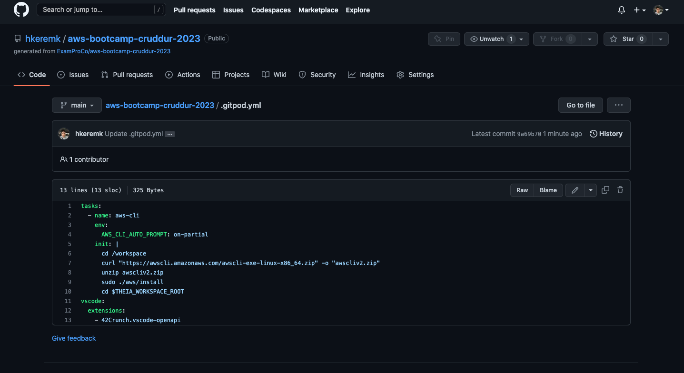
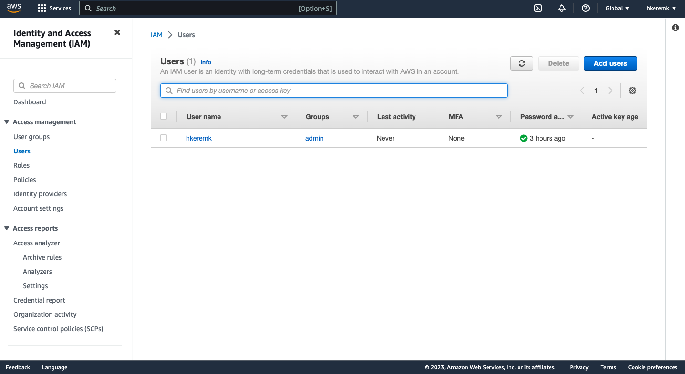
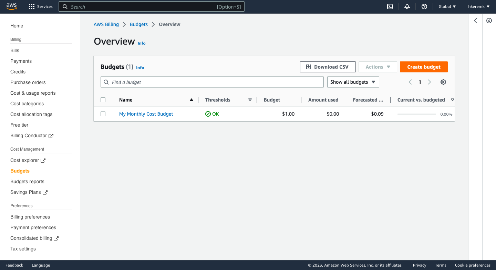

# Week 0 — Billing and Architecture

## Required Homework/Tasks

### Install AWS CLI

Installed AWS CLI and when i open to gitpod everytime its ready to use you can see in gitpod.yml files.

IAM user

I created budget in my AWS account.

Then I created billing alarm for maximum threshold for 3 dollars limit.

Lastly, logical diagram for CrudderApp

